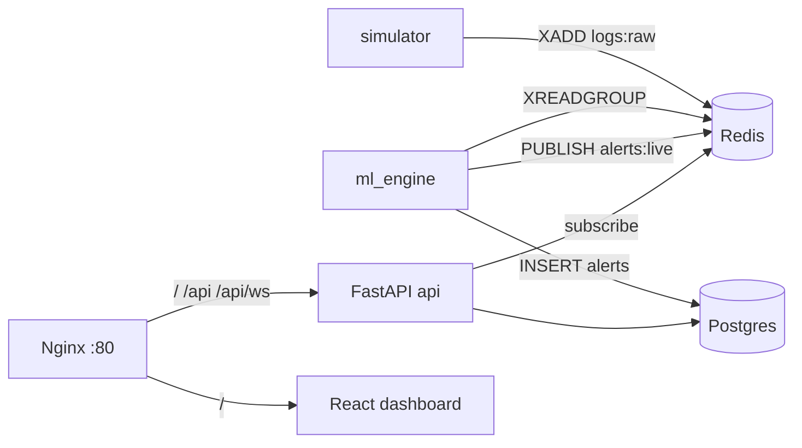

# SOC Simulator

AI-powered threat detection stack: **log simulator** → **Redis Streams** → **ML engine** (Isolation Forest + LSTM) → **Postgres** + **Redis pub/sub** → **FastAPI** → **WebSocket** → **React dashboard**, with **Nginx** as a single entry point on port 80.

## Architecture



| Path | Purpose |
|------|---------|
| [`api/`](api/) | FastAPI: REST + WebSocket fan-out from Redis |
| [`dashboard/`](dashboard/) | Vite + React SOC UI |
| [`ml_engine/`](ml_engine/) | Stream consumer, scoring, alerts, `train_initial.py` |
| [`simulator/`](simulator/) | Faker-based events → Redis + optional Postgres |
| [`db/`](db/) | `init.sql`, `seed_*.sql`, migrations |
| [`nginx/`](nginx/) | Reverse proxy: `/`, `/api/`, `/api/ws/` |
| [`scripts/`](scripts/) | `wait-for-it.sh`, `seed.sh`, `demo.sh` |

## Quick start

1. **Clone** and enter the project root:
   ```bash
   cd soc-simulator
   ```

2. **Environment** (do not commit real secrets):
   ```bash
   cp .env.example .env
   ```
   Edit `.env` and set **`ANTHROPIC_API_KEY`** for Claude-based alert explanations in `ml_engine`. Other defaults match Docker Compose service names.

3. **First-time DB** (existing volumes): if you added columns after first boot, run [`db/migrate_phase7_alerts.sql`](db/migrate_phase7_alerts.sql) once.

4. **Run the stack** (interactive logs):
   ```bash
   make up
   ```
   Or detached + seed in one go:
   ```bash
   make bootstrap
   ```
   `bootstrap` runs `docker compose up --build -d`, waits briefly, then [`scripts/seed.sh`](scripts/seed.sh) (SQL seeds, `train_initial.py`, one simulator batch).

5. **Seed manually** (any time the stack is up):
   ```bash
   make seed
   ```

6. **Open the app**
   - **Through Nginx:** http://localhost/ (dashboard), http://localhost/api/ (API)
   - **Direct:** API http://localhost:8000 — Dashboard http://localhost:3000

Dashboard Vite env for local dev is in [`dashboard/.env`](dashboard/.env) (`VITE_API_URL`, `VITE_WS_URL`).

## Services (Docker Compose)

| Service | Role | Host ports |
|---------|------|------------|
| `redis` | Streams + pub/sub | 6379 |
| `db` | Postgres | 5432 |
| `simulator` | Pushes synthetic logs | — |
| `ml_engine` | Anomaly detection + alerts | — |
| `api` | REST + WebSocket | 8000 |
| `dashboard` | Vite dev server | 3000 |
| `nginx` | Front door | 80 |

Services wait on **healthy** `redis` and `db` where applicable; `api` exposes a **healthcheck**; `dashboard` starts after `api` is healthy; `nginx` waits for a healthy `api` and a started `dashboard`.

## API reference

| Method | Path | Description |
|--------|------|-------------|
| `GET` | `/api/health` | Liveness JSON `{ "status": "ok", ... }` |
| `GET` | `/api/stats` | 24h aggregates (Redis JSON cache ~30s; invalidated on live alerts) |
| `GET` | `/api/stats/heatmap` | Top source IPs × UTC hour; max severity per cell |
| `GET` | `/api/alerts` | Query: `limit`, `offset`, `severity_min`, `acknowledged`, `since` |
| `GET` | `/api/alerts/export` | CSV download (last 24h alerts) |
| `POST` | `/api/debug/inject-attack` | Demo: enqueue synthetic high-signal log to `logs:raw` |
| `GET` | `/api/alerts/{id}` | Single alert |
| `PATCH` | `/api/alerts/{id}/acknowledge` | Acknowledge |
| `GET` | `/api/logs` | Query: `limit`, `offset`, `source_ip`, `q` |
| `WS` | `/api/ws/alerts` | Live alerts (camelCase JSON after API transform) |

**Portfolio / demo UX:** the dashboard shows a **live WebSocket event counter** in the header, **Sonner** toasts for new **CRITICAL** alerts (severity ≥ 9), a **Simulate attack** control (calls inject-attack), and the **severity heatmap**. Optional **`SLACK_WEBHOOK_URL`** in `.env` makes `ml_engine` post when severity ≥ 9.

## Verification checklist

```bash
curl -s http://localhost/api/health
curl -s http://localhost/api/stats
curl -s http://localhost/api/alerts
```

Open http://localhost and watch the dashboard for new alerts (simulator + `ml_engine` must be running; scores must exceed the configured threshold).

## Real syslog / production ingestion

- **Same contract as the simulator:** JSON payloads on Redis stream **`logs:raw`** (field `data`), each value a log object with at least: `timestamp`, `source_ip`, `destination_port`, `protocol`, `event_type`, `bytes_transferred`, `raw_message` (see [`ml_engine/features.py`](ml_engine/features.py) for the full feature vector).
- **Postgres `logs` table** matches [`db/init.sql`](db/init.sql); the simulator also inserts rows for persistence.
- For on-prem syslog, add a small **forwarder** service that parses RFC5424/json and `XADD`s to `logs:raw`, or extend the simulator with a file tail mode.

## Makefile

| Target | Action |
|--------|--------|
| `make up` | `docker compose up --build` |
| `make down` | `docker compose down` |
| `make logs` | Follow container logs |
| `make seed` | [`scripts/seed.sh`](scripts/seed.sh) |
| `make bootstrap` | Detached up + seed |

**Recorded demo:** [`scripts/demo.sh`](scripts/demo.sh) runs `docker compose up --build -d`, waits, then posts to `/api/debug/inject-attack` several times (override base with `DEMO_API_BASE` if needed).

## Development notes

- **`ml_engine` / `simulator`** entrypoints use [`scripts/wait-for-it.sh`](scripts/wait-for-it.sh) for `redis:6379` and `db:5432` before the main process.
- **Models:** `ml_engine/models/isolation_forest.joblib` and `lstm.pt` (legacy `iforest.joblib` is still loaded if present). Training runs from DB logs via `train_initial.py` or inline on startup if files are missing.
